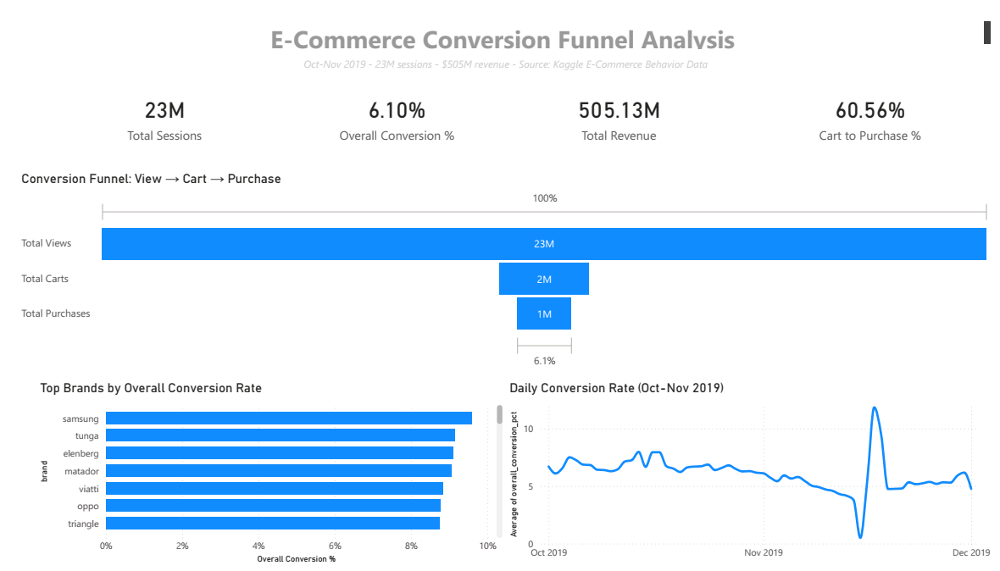

# E-Commerce Funnel Analysis

## Executive Summary

**The business problem:** An online retailer is sitting on 110M user events from October and November 2019 but has no clear picture of where shoppers drop out of the funnel. Without that, every marketing dollar is a guess.

**The solution:** I built a pipeline that loads the raw events into MySQL, rolls them up into per-session and per-day summary tables, and feeds a Power BI dashboard that shows the View → Cart → Purchase journey across 23M sessions.

**The number impact:** 90% of sessions never reach the cart, but 60% of carts convert to purchase. Overall conversion lands at 6.1% on $505M in revenue. The bottleneck is at the top of the funnel, not at checkout.

**A few next steps:** Focus product and ad spend on the View → Cart drop. Look at why electronics and auto-parts brands convert so much better than the average and apply what works to weaker categories. Pull in December data to confirm the Black Friday spike isn't a one-off.

## Stack

* **SQL (MySQL):** CTEs, joins, CASE expressions, aggregate functions, indexing, materialized summary tables
* **Power BI:** DAX measures, data modeling, funnel & trend visualizations, dashboard design
* **Python:** Pandas, SQLAlchemy, ETL pipelines, data cleaning, chunked processing
* **Tools:** MySQL Workbench, VS Code, Git, GitHub

## The Business Problem

The dataset is two months of behavioral logs from a multi-category online store: every product view, cart add, and purchase across 23 million sessions. The store records the events but doesn't have a working view of the funnel. That means nobody internally can answer basic questions like:

* Where in the journey are we losing the most people?
* Is the problem that shoppers aren't engaging, or that they engage and then bail at checkout?
* Which brands and categories actually convert, and which are just collecting clicks?
* Did Black Friday actually move the needle, or did it just shift demand around?

Without those answers, every optimization decision is guesswork. Marketing might pour money into top-of-funnel ads when the real leak is at checkout, or a product team might rebuild the cart flow when the real issue is people never adding anything in the first place. The cost of guessing wrong is wasted spend on the wrong fix.

The job here is simple: turn 110M raw events into a dashboard that shows where the money actually leaks, so the next decision can be made with numbers instead of opinions.

## Methodology

* **ETL pipeline** in Python (pandas) for extraction, cleaning, and batch loading.
* **Data wrangling**: deduplication, null handling, type downcasting, and event filtering.
* **SQL** (MySQL) for schema design, indexing, and aggregation queries.
* **Data modeling**: per-session and per-day summary tables to pre-compute KPIs.
* **DAX measures** in Power BI for conversion rates and drop-off calculations.
* **Funnel analysis** and brand-level segmentation.
* **Data quality investigation**: spotted, traced, and mitigated a session-attribution anomaly.
* **Dashboard design** with KPI cards, funnel visual, trend lines, and bar charts.

## Key Engineering Challenges
1.  **Handling Big Data:** The raw datasets exceeded local RAM (5GB+). **Used chunking to process the 5GB + CSVs** without exceeding RAM limit.
2.  **Database Optimization:** Designed a normalized schema with **B-Tree Indices** on `user_session` to reduce query lookup time.
3.  **Idempotent Pipeline:** Built the ETL loader to safely handle re-runs using `if_exists='append'` and transaction safety.

## The Data Pipeline
1.  **Extract:** Python scripts ingest raw CSV logs.
2.  **Transform:**
    * Filtered for valid funnel events (`view`, `cart`, `purchase`).
    * Downcasted numeric types to optimize memory usage.
    * Removed null data.
3.  **Load:** Batch-inserted cleaned data into local MySQL instance using SQLAlchemy engine.
4.  **Analyze:** SQL aggregation queries compute funnel metrics into a materialized summary table.

## Results

Analyzed **~110M raw events** across **23M user sessions** from October–November 2019.

| Funnel Stage | Sessions | Conversion |
|---|---|---|
| View | 23,005,603 | — |
| Cart | 2,316,432 | **10.07%** of views |
| Purchase | 1,402,758 | **60.56%** of carts |

**Total Revenue:** ~$505M

### Key Insights
* **90% of sessions never add an item to cart.** This is where the funnel bleeds. Fixing this issue matters more than checkout optimization.
* **Cart → Purchase: 60.56%.** Once people add to cart, checkout works fine.
* **Overall view-to-purchase rate: ~6.1%.** Above the typical 2-5% retail benchmark. The catalog converts, the top of the funnel just leaks.
* **Top-converting brands are mostly electronics and auto parts** (Samsung, Oppo, Matador, Viatti). High-consideration categories where people show up ready to buy.
* **Black Friday spike visible** in late-November daily conversion rate, confirming seasonal effects in the trend line.

## Data Quality Findings

Found a data quality issue while building the per-session aggregation: many sessions had a `purchase` event without any preceding `cart` event, causing per-day cart-to-purchase ratios to exceed 100% on early-October dates (e.g. 161% on Oct 1).

**Likely causes:**
* "Buy Now" / one-click purchase paths that bypass the cart step
* Upstream tracking gaps in the raw event log
* Cross-session attribution drift (cart in session A, purchase in session B)

**Mitigation:** Built a parallel `funnel_daily_clean` table that aggregates conversion directly from `raw_events` using distinct sessions per event type per day. This gives a clean trend (0.5%–11.84% range) and was used for the daily conversion line chart in the dashboard.

## Business Recommendations

* **Fix the View → Cart leak first.** 90% of the lost revenue is here. Test product page changes (clearer pricing, better images, social proof) before touching anything downstream.
* **Don't waste effort on checkout.** Cart → Purchase already converts at 60%. Any time spent re-skinning the cart flow is time not spent fixing the real problem.
* **Study what the top brands are doing right.** Samsung, Oppo, Matador, and Viatti convert well above average. Look at their product pages, pricing, and reviews and copy what works to weaker categories.
* **Plan for Black Friday volume.** The Nov 29 spike confirms a real seasonal pattern. Make sure infrastructure, inventory, and ad spend are scaled for it next year.

## Next Steps

* **Pull in December data** to confirm the Black Friday spike isn't a one-off and to capture the holiday tail.
* **Add category-level breakdown** to the dashboard so the brand insights can be generalized.
* **Cohort analysis**: do returning users convert better than first-timers? Worth knowing before the marketing team spends on retargeting vs. acquisition.
* **Fix the upstream tracking gap** that caused the cart anomaly. Either the source events are missing or the session attribution logic needs work.
* **Set up a scheduled refresh** so the dashboard updates automatically as new data lands instead of being a one-shot snapshot.